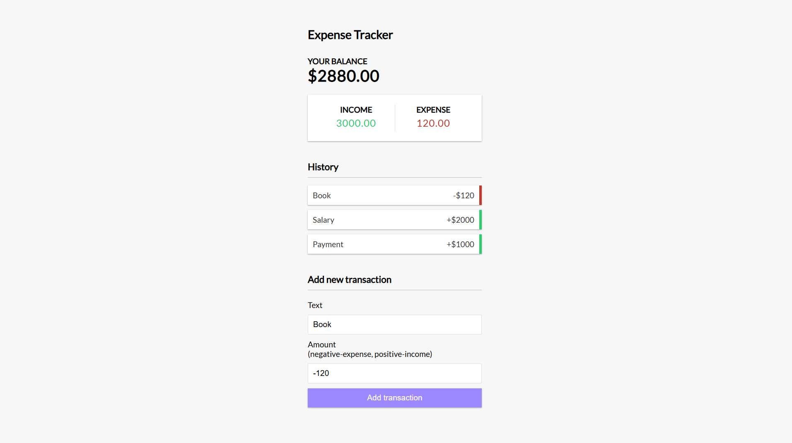

### **README.md**

# 💰 Expense Tracker App  

A simple **React-based** expense tracker that helps you monitor income and expenses effectively.


## Video Demo 📽️

Watch the demo of Expense Tracker on YouTube:
<a href="https://youtu.be/nZixoh50PoU" target="_blank">
    
</a>


## **🚀 Features**
✅ Track **income and expenses**  
✅ View **total balance** dynamically  
✅ **Add & delete transactions** seamlessly  
✅ **Real-time UI updates** using Context API  

## **🛠 Tech Stack**
- **Frontend:** React (Vite), Context API  
- **State Management:** useReducer, useContext  
- **Styling:** CSS  
- **Build Tool:** Vite  

## **📂 Folder Structure**
```
📁 6_EXPENSE-TRACKER-APP/
│── 📂 public/                  # Static assets  
│── 📂 src/                     # Source code  
│   ├── 📂 assets/              # Images & icons  
│   ├── 📂 Components/          # UI Components  
│   │   ├── 📄 AddTransaction.jsx   # Add new transaction form  
│   │   ├── 📄 Balance.jsx         # Display total balance  
│   │   ├── 📄 Header.jsx          # App header  
│   │   ├── 📄 IncomeExpenses.jsx  # Income & expense summary  
│   │   ├── 📄 Transaction.jsx     # Transaction component  
│   │   ├── 📄 TransactionList.jsx # List of transactions  
│   ├── 📂 context/             # Global state management  
│   │   ├── 📄 AppReducer.jsx     # Reducer for state updates  
│   │   ├── 📄 GlobalState.jsx    # Context API provider  
│   ├── 🎨 App.css              # Global styles  
│   ├── ⚛️ App.jsx              # Main app component  
│   ├── 🎨 index.css            # Base styles  
│   ├── 🚀 main.jsx             # Root file  
│── 🌍 index.html               # Main HTML file  
│── 📜 package.json             # Dependencies & scripts  
│── ⚙️ vite.config.js           # Vite config  
│── 📖 README.md                # Documentation  
```

## **📥 Installation**
### 1️⃣ Clone the repository  
```sh
git clone https://github.com/yourusername/expense-tracker.git
cd expense-tracker
```

### 2️⃣ Install dependencies  
```sh
npm install
```

### 3️⃣ Run the app  
```sh
npm run dev
```
The app will be available at **http://localhost:5173/**.


## **💡 How to Use**
1. **➕ Add Transactions**: Enter a name and amount (negative for expenses, positive for income).  
2. **📊 View Summary**: See your **total balance, income, and expenses**.  
3. **🗑️ Delete Transactions**: Click ❌ to remove an unwanted transaction.  

## **🤝 Contributing**
Pull requests are welcome! Feel free to fork the project and contribute.

## **📜 License**
This project is licensed under the **MIT License**.

