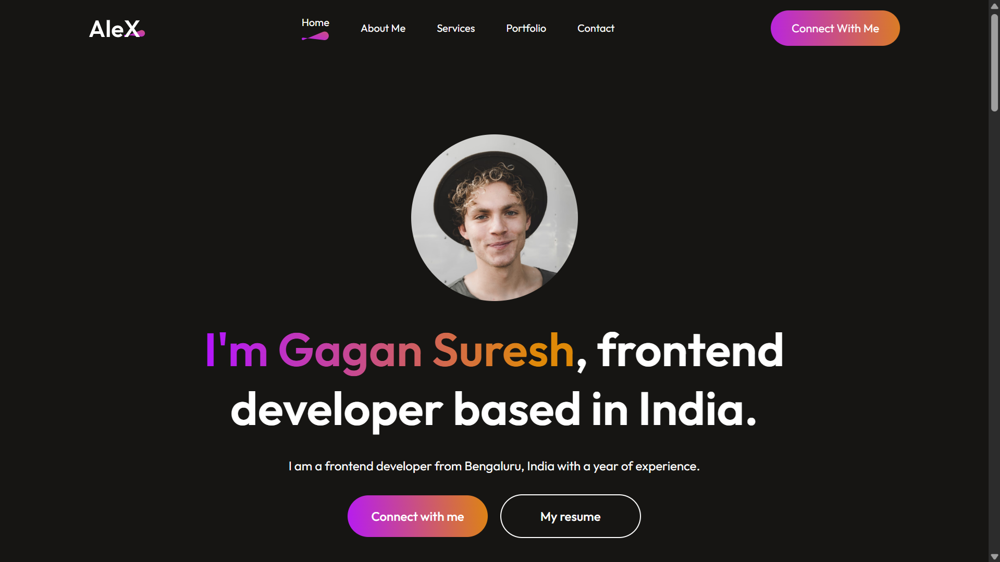

## 📂 Folder Structure

```
📦 React-Mini-Projects/
│── 📂 Portfolio/
│   ├── 📂 src/                            # Source files
│   │   ├── 📂 components/                 # Reusable UI components
│   │   │   ├── 📂 About/                  # ℹ️ About section
│   │   │   │   ├── 📝 About.jsx           # About section logic
│   │   │   │   ├── 🎨 About.css           # Styling for About section
│   │   │   ├── 📂 Contact/                # 📩 Contact form
│   │   │   │   ├── 📝 Contact.jsx         # Contact form logic (Web3Forms integrated)
│   │   │   │   ├── 🎨 Contact.css         # Styling for Contact section
│   │   │   ├── 📂 Footer/                 # 🔗 Footer section
│   │   │   │   ├── 📝 Footer.jsx          # Footer logic
│   │   │   │   ├── 🎨 Footer.css          # Styling for Footer section
│   │   │   ├── 📂 Hero/                   # 🚀 Hero (Intro + CTA)
│   │   │   │   ├── 📝 Hero.jsx            # Hero section logic
│   │   │   │   ├── 🎨 Hero.css            # Styling for Hero section
│   │   │   ├── 📂 MyWork/                 # 💼 Projects showcase
│   │   │   │   ├── 📝 MyWork.jsx          # Projects showcase logic
│   │   │   │   ├── 🎨 MyWork.css          # Styling for Projects section
│   │   │   ├── 📂 NavBar/                 # 🧭 Navigation bar
│   │   │   │   ├── 📝 NavBar.jsx          # Navbar logic (useState, useRef)
│   │   │   │   ├── 🎨 NavBar.css          # Styling for Navbar
│   │   │   ├── 📂 Services/               # 🛠️ Services offered
│   │   │   │   ├── 📝 Services.jsx        # Services section logic
│   │   │   │   ├── 🎨 Services.css        # Styling for Services section
│   │   ├── 📂 assets/                     # 📁 Static assets & data
│   │   │   ├── 📜 services_data.js        # Services list (s_no, s_name, s_desc)
│   │   │   ├── 📜 mywork_data.js          # Projects list (w_no, w_name, w_img)
│   │   ├── 📝 App.jsx                     # 🎯 Main application file (imports all components)
│   │   ├── 🏁 index.js                    # 🔥 React entry point
│   ├── 📂 public/                         # 🌍 Public static files (favicon, images, etc.)
│   ├── 📜 package.json                     # 📦 Dependencies & scripts
│   ├── 📖 README.md                        # 📃 Project documentation
```

---

## 📖 **Project README**

# 🚀 Personal Portfolio Website

A fully responsive and modern **React.js** portfolio website showcasing my **skills, projects, and services**.

## Video Demo 📽️

Watch the demo of Passop on YouTube:
<a href="https://www.youtube.com/watch?v=CZzI-As6I0g" target="_blank">
    
</a>


## 🔥 Features

- 🎨 **Responsive Design** – Styled with CSS and `@media()` queries.
- 🧭 **Smooth Navigation** – `useState`, `useRef` used for section navigation.
- 💼 **Projects & Services** – Data-driven display from `assets` files.
- 📩 **Contact Form** – Integrated with **Web3Forms** for message handling.
- ⚡ **Optimized Performance** – Component-based structure for scalability.

---

## 🏗️ **Project Structure & Components**

### 🔹 **Navigation Bar (`NavBar`)**

- Uses `useState` and `useRef` for **smooth navigation**.
- **Initial state** set to **Home page**.

### 🔹 **Hero Section (`Hero`)**

- Engaging **intro with a call-to-action** button.

### 🔹 **About Me (`About`)**

- **Brief bio** and **skills showcase**.

### 🔹 **Services (`Services`)**

- Dynamically **renders from `services_data.js`**.

### 🔹 **Projects (`MyWork`)**

- **Displays projects dynamically** from `mywork_data.js`.

### 🔹 **Contact Section (`Contact`)**

- Integrated with **Web3Forms** for **handling user messages**.

### 🔹 **Footer (`Footer`)**

- Social links and **copyright information**.

---

## 📦 **Installation & Setup**

1️⃣ **Clone the repository**

```sh
git clone https://github.com/gaganProgramming/React-Mini-Projects.git
cd React-Mini-Projects/Portfolio
```

2️⃣ **Install dependencies**

```sh
npm install
```

3️⃣ **Run the development server**

```sh
npm start
```

4️⃣ **Open** [http://localhost:3000](http://localhost:3000) in your browser.

---

## 🚀 **Deployment**

This project can be deployed on **Vercel** or **Netlify**.

🔹 **Vercel Deployment Steps**:

1. Push your code to GitHub.
2. Connect the repository to **Vercel**.
3. Deploy with a **single click**.

---

## 🛠️ **Tech Stack**

- ⚛️ **Frontend**: React.js, CSS
- ⚡ **State Management**: useState, useRef
- 📩 **Forms**: Web3Forms
- 🚀 **Deployment**: Vercel / Netlify

---

## 🤝 **Contributing**

Feel free to **fork**, **open issues**, and **submit PRs**.

---

## 📬 **Contact**

- **GitHub**: [gaganProgramming](https://github.com/gaganProgramming)
- **LinkedIn**: [Gagan Suresh](https://www.linkedin.com/in/gagan-suresh)
- **Email**: gagan.0191@gmail.com

---
